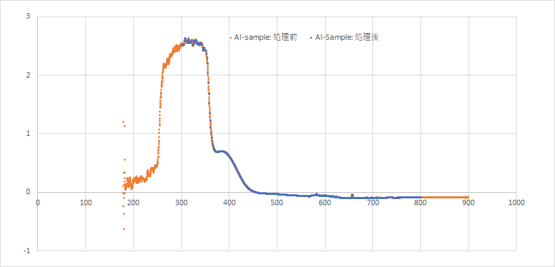

# AbsTools

化学実験Aで吸光度の測定データを前処理するツール（群）です。

現時点ではコマンドライン上で動きます

現時点で対応しているプラットフォーム：
  - Windows GUI (ウィンドウが表示されてマウスとかで操作できるやつ)
  - Windows Command Line
  - （開発中）macOS Command Line
 
## 使い方
生データのテキストファイルから，波長を1 nmごと，300-799 nmの範囲に対応させた吸光度のデータのみを含むファイルを生成します。

### Windows GUI版

[リリースページ](https://github.com/YIsoda/AbsTools/releases)から[AbsSimplifierGUI.exe](https://github.com/YIsoda/AbsTools/releases/download/v0.2.1/AbsSimplifierGUI.exe)をダウンロードしてください。
ダウンロードしたファイルをダブルクリックすると以下のように窓が開きます。


リストのところに前処理したいファイルをドラッグ＆ドロップすると読み込まれるので，**1ファイルに出力**，**元のフォルダに出力**，**出力フォルダを指定して変換**のいずれかをクリックして保存してください。
**1ファイルに出力**の場合のみ，一覧にあるファイルが1ファイルに統合されてTSV形式で保存されます。Excelで開いて編集した後は名前を付けて保存してください。

### Windows Command Line版

[リリースページ](https://github.com/YIsoda/AbsTools/releases)から[AbsSimplifier.exe](https://github.com/YIsoda/AbsTools/releases/download/v0.1/AbsSimplifier.exe)をダウンロードして，適当な場所においてください。

PowerShellまたはコマンドプロンプト上で実行します。引数に生データファイルの相対or絶対パスを指定して実行ください（複数のファイルを指定可能です）。実行するとファイル名に“-simplified”を付けたファイルが生成されます。

```powershell
PS> AbsSimplifier.exe absData1.txt absData2.txt ...
  absData1.txt  ->  absData1-simplified.txt
  absData2.txt  ->  absData2-simplified.txt
  ...
```

元ファイル

```
SpectraSuiteﾃﾞｰﾀﾌｧｲﾙ
++++++++++++++++++++++++++++++++++++
日時: Mon Jun 11 14:59:44 JST 2018
ﾕｰｻﾞ: YoshimuraY
ﾀﾞｰｸｽﾍﾟｸﾄﾙ: はい
ﾘﾌｧﾚﾝｽｽﾍﾟｸﾄﾙ: はい
ｻﾝﾌﾟﾙｺﾝﾎﾟﾈﾝﾄｽﾍﾟｸﾄﾙ数: 1
分光器: USB4F06998
Integration Time (usec): 60000 (USB4F06998)
ｽﾍﾟｸﾄﾙ平均: 5 (USB4F06998)
平滑化: 5 (USB4F06998)
暗電流補正: はい (USB4F06998)
ﾊﾟﾙｽ信号/光源有効: はい (USB4F06998)
ﾊﾟﾙｽ/光源　起動: いいえ (USB4F06998)
迷光の補正: いいえ (USB4F06998)
処理済みｽﾍﾟｸﾄﾙﾋﾟｸｾﾙ数: 3648
>>>>>Begin Processed Spectral Data<<<<<
176.72	-0.000
176.95	-0.000
...
```

変換後のファイル
```
0.0410
0.0391
0.0384
0.0370
0.0370
0.0370
...
```



※ウイルスバスターにブロックされるようです（署名とかなにもしてないので。すいません...）。［開く］を押すと実行できると思います。
また，Windows10以外では確認していませんので，動かないかもしれません（.NET Framework 4.5以上必要）

### macOS Commamd Line版
[zip](https://github.com/YIsoda/AbsTools/releases/download/v0.1/AbsSimplifier_osx-x64.zip)を落として展開し，中のAbsConvertCoreを実行すると動くかも


